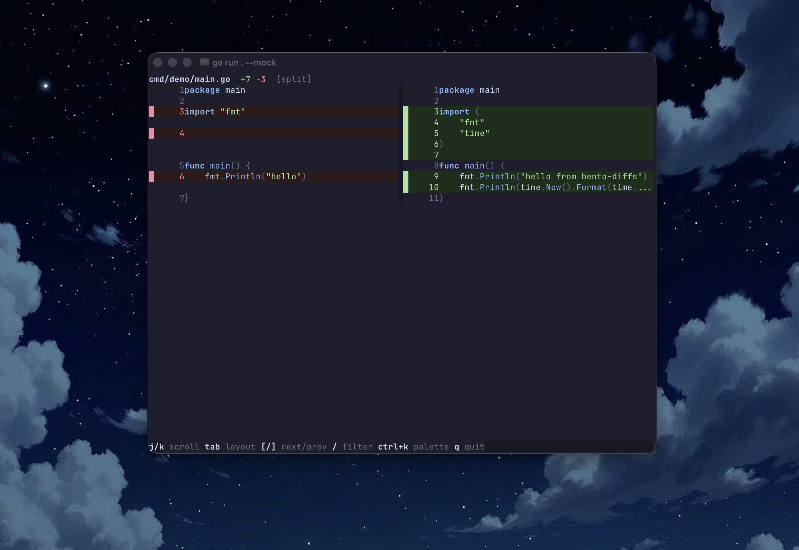

# bentodiffs

Terminal diff tool with a full standalone TUI app shell and an embeddable Go viewer package.



## Repo layout

```text
cmd/bento-diffs/   CLI entrypoint
pkg/bentodiffs/    embeddable parser + renderer + workspace + viewer APIs
pkg/bentodiffs/tui standalone app shell (home, commits, diff routes)
bricks/            local Bento bricks consumed by viewer
recipes/           local Bento recipes consumed by viewer
docs/              architecture notes
```

## CLI

Run the full app shell:

```bash
go run ./cmd/bento-diffs
```

Repo discovery reads config from:

```text
~/.config/bentodiffs/config.json
```

Example:

```json
{
  "repo_roots": [
    "/Users/you/code"
  ]
}
```

Run the mock diff route:

```bash
go run ./cmd/bento-diffs --mock
```

Build and run:

```bash
go build -o bento-diffs ./cmd/bento-diffs
./bento-diffs --mock
```

Run with two files:

```bash
go run ./cmd/bento-diffs before.txt after.txt
```

Run with a patch file:

```bash
go run ./cmd/bento-diffs --patch changes.diff
```

## Library

```go
package main

import (
	"log"

	bentodiffs "github.com/cloudboy-jh/bento-diffs"
)

func main() {
	opts := bentodiffs.DefaultOptions()
	diffs, err := bentodiffs.ParseUnifiedDiffs("diff --git a/a.txt b/a.txt\n--- a/a.txt\n+++ b/a.txt\n@@ -1 +1 @@\n-old\n+new\n")
	if err != nil {
		log.Fatal(err)
	}
	if err := bentodiffs.RunDiffs(diffs, opts); err != nil {
		log.Fatal(err)
	}
}
```
